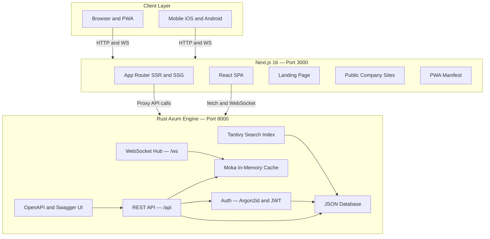
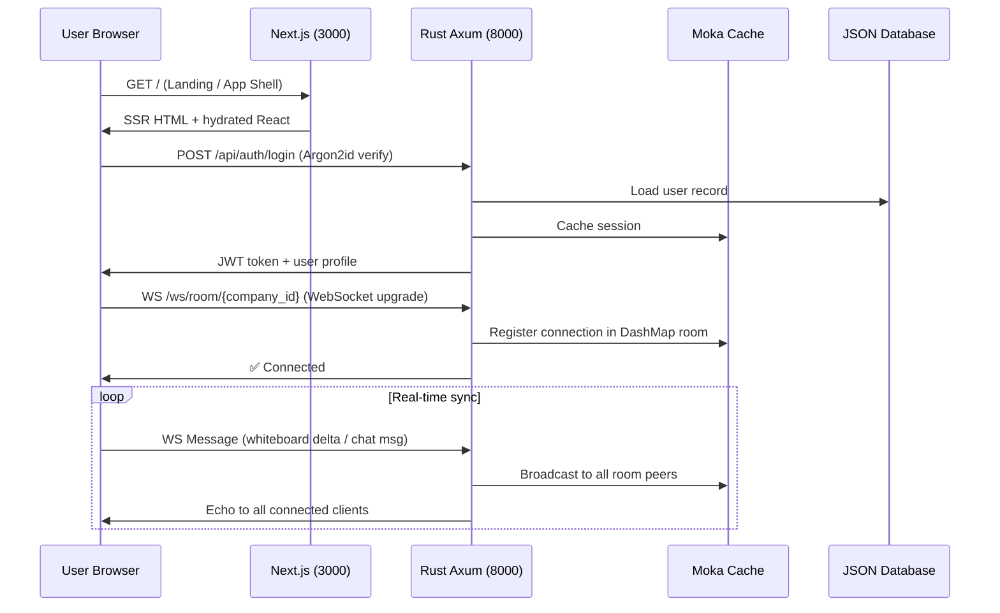
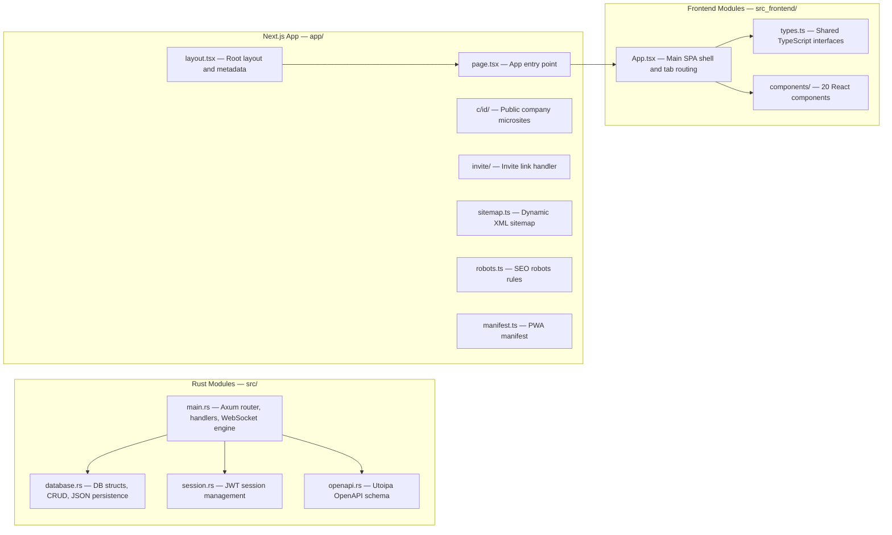
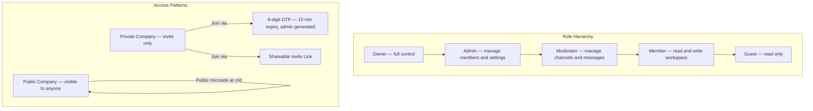
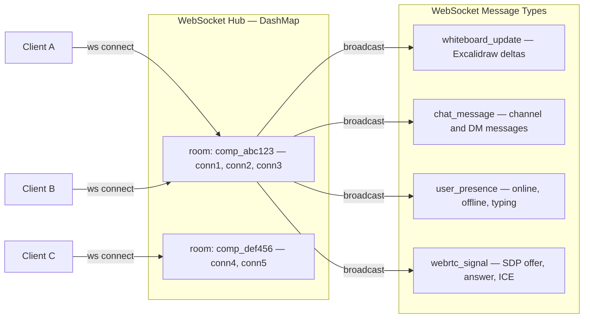

<div align="center">

# TheySynced

**A production-grade collaborative office platform built with Rust + Next.js**

*Real-time whiteboards · Spreadsheets · Docs · HD Video Meetings · Team Chat*

[](https://www.rust-lang.org/)
[](https://nextjs.org/)
[](LICENSE)
[](package.json)

</div>

---

## What is TheySynced?

TheySynced is a self-hostable, enterprise collaborative workspace — think Notion + Figma + Teams, but built on a blazing-fast Rust backend with a premium Apple-inspired Next.js frontend. Every feature runs in a single monorepo with zero external cloud dependencies.

You get a full office suite out of the box:

| Feature | What it does |
|---------|-------------|
| 🎨 **Excalidraw Whiteboard** | Real-time vector drawing synced over WebSocket |
| 📊 **Excel Spreadsheets** | Formula engine with SUM, AVERAGE, MAX, MIN, COUNT + charts |
| 📝 **Rich-Text Docs** | Notion-style editor with PDF export |
| 🎥 **HD Video Meetings** | WebRTC multi-participant video/audio with screen share |
| 💬 **Team Chat** | Discord-style channels + Direct Messaging with file attachments |
| 🏢 **Multi-Tenant Companies** | Create/join companies, manage roles, generate OTP invites |
| 🔍 **Full-Text Search** | Tantivy-powered search across all workspace content |
| 🌐 **Public Company Sites** | Every company gets a public microsite at `/c/[id]` |

---

## Architecture

TheySynced uses a clean 2-tier architecture: a Rust Axum engine handling all business logic, auth, WebSockets, and storage — and a Next.js 16 App Router frontend serving the UI as a PWA.

### High-Level Overview



### Request Flow



### Data & Module Map



### Company & Access Control Model



### WebSocket Room Architecture



---

## Tech Stack

### Backend (Rust)

| Crate | Version | Purpose |
|-------|---------|---------|
| `axum` | 0.7 | HTTP + WebSocket server framework |
| `tokio` | 1 | Async runtime (full features) |
| `tower-http` | 0.5 | CORS, static file serving, tracing |
| `serde` / `serde_json` | 1 | JSON serialization |
| `jsonwebtoken` | 9 | JWT auth tokens |
| `argon2` | 0.5 | Password hashing (Argon2id) |
| `moka` | 0.12 | Async in-memory LRU/TTL cache |
| `tantivy` | 0.22 | Full-text search engine |
| `dashmap` | 5 | Concurrent HashMap for WS rooms |
| `uuid` / `ulid` | 1 | ID generation |
| `utoipa` | 4 | OpenAPI 3 spec generation |
| `utoipa-swagger-ui` | 6 | Swagger UI endpoint |
| `chrono` | 0.4 | Date/time with serde support |
| `validator` | 0.18 | Request validation with derive macros |
| `anyhow` / `thiserror` | 1/2 | Error handling |

### Frontend (TypeScript / React)

| Package | Purpose |
|---------|---------|
| `next` 16 | App Router SSR/SSG framework |
| `react` 18 | UI library |
| `@excalidraw/excalidraw` | Vector whiteboard component |
| `@tiptap/react` | Rich text editor (Notion-style) |
| `jspreadsheet-ce` | Excel-style spreadsheet grid |
| `iconoir-react` | Premium icon set |
| `lucide-react` | Additional icon set |
| `gsap` | Animation library |
| `fuse.js` | Client-side fuzzy search |
| `idb` | IndexedDB wrapper for offline storage |
| `tailwindcss` | Utility-first CSS framework |
| `clsx` + `tailwind-merge` | Conditional class utilities |

---

## API Endpoints

The Rust backend exposes a fully documented REST API. Visit `http://localhost:8000/swagger-ui` for the interactive OpenAPI spec.

### Auth
| Method | Path | Description |
|--------|------|-------------|
| `POST` | `/api/auth/signup` | Create a new user account |
| `POST` | `/api/auth/login` | Login and receive JWT |
| `GET` | `/api/auth/me` | Get current user profile |
| `PUT` | `/api/auth/me` | Update profile / avatar |

### Companies
| Method | Path | Description |
|--------|------|-------------|
| `POST` | `/api/companies` | Create a new company workspace |
| `GET` | `/api/companies/:id` | Get company details |
| `PUT` | `/api/companies/:id` | Update company settings (admin+) |
| `POST` | `/api/companies/:id/join` | Join via OTP code |
| `POST` | `/api/companies/:id/invite` | Generate OTP invite (admin+) |
| `GET` | `/api/companies/:id/members` | List all company members |
| `PUT` | `/api/companies/:id/members/:uid/role` | Update member role (admin+) |
| `DELETE` | `/api/companies/:id/members/:uid` | Remove member (admin+) |

### Teams & Channels
| Method | Path | Description |
|--------|------|-------------|
| `GET` | `/api/companies/:id/teams` | List all teams |
| `POST` | `/api/companies/:id/teams` | Create a team |
| `GET` | `/api/companies/:id/channels` | List channels in a team |
| `POST` | `/api/companies/:id/channels` | Create a channel |
| `GET` | `/api/companies/:id/channels/:cid/messages` | Get channel message history |
| `POST` | `/api/companies/:id/channels/:cid/messages` | Post a message |

### Direct Messages
| Method | Path | Description |
|--------|------|-------------|
| `GET` | `/api/companies/:id/dms` | List DM conversations |
| `POST` | `/api/companies/:id/dms` | Start a new DM |
| `GET` | `/api/companies/:id/dms/:uid/messages` | Get DM history |

### Workspace Assets (Docs, Whiteboards, Spreadsheets)
| Method | Path | Description |
|--------|------|-------------|
| `GET` | `/api/companies/:id/assets` | List all workspace assets |
| `POST` | `/api/companies/:id/assets` | Create a new asset |
| `GET` | `/api/companies/:id/assets/:aid` | Get asset content |
| `PUT` | `/api/companies/:id/assets/:aid` | Save asset content |
| `DELETE` | `/api/companies/:id/assets/:aid` | Delete asset |

### Search
| Method | Path | Description |
|--------|------|-------------|
| `POST` | `/api/search` | Full-text search (Tantivy) across all assets |

### WebSocket
| Path | Description |
|------|-------------|
| `WS /ws/room/:company_id` | Real-time room for whiteboard, chat, presence, WebRTC signaling |

---

## Project Structure

```
theysynced/
├── src/                        # Rust backend
│   ├── main.rs                 # Axum router, all HTTP + WS handlers
│   ├── database.rs             # Data models, CRUD ops, JSON persistence
│   ├── session.rs              # JWT session management
│   └── openapi.rs              # Utoipa OpenAPI schema
│
├── src_frontend/               # React SPA (embedded in Next.js)
│   ├── App.tsx                 # Main shell + tab router
│   ├── types.ts                # Shared TypeScript types
│   ├── index.css               # Global SPA styles
│   └── components/
│       ├── LandingPage.tsx     # Marketing landing page
│       ├── Navbar.tsx          # Top navigation bar
│       ├── Sidebar.tsx         # Desktop left sidebar
│       ├── OfficeOverviewGrid.tsx  # Home bento grid
│       ├── AuthModal.tsx       # Sign in / Sign up modal
│       ├── CompanyModal.tsx    # Create/join company
│       ├── CompanySettingsModal.tsx
│       ├── InviteModal.tsx     # OTP invite generation
│       ├── UserSettingsModal.tsx
│       ├── CommandPalette.tsx  # ⌘K search palette
│       ├── ChatView.tsx        # Teams, channels, DMs
│       ├── ExcalidrawBoard.tsx # Vector whiteboard
│       ├── SpreadsheetView.tsx # Excel-style spreadsheet
│       ├── DocsView.tsx        # Rich text document editor
│       ├── VideoMeetingView.tsx# WebRTC video meetings
│       ├── ActivityHubView.tsx # Audit logs + activity feed
│       ├── AngelListCardGrid.tsx   # Team member cards
│       ├── CompanyPublicSite.tsx   # Public /c/[id] page
│       ├── ConfirmModal.tsx
│       └── UserAvatar.tsx
│
├── app/                        # Next.js App Router
│   ├── layout.tsx              # Root layout + SEO metadata
│   ├── page.tsx                # Entry point → mounts React SPA
│   ├── globals.css             # Next.js global styles
│   ├── manifest.ts             # PWA web manifest
│   ├── sitemap.ts              # Dynamic sitemap.xml
│   ├── robots.ts               # robots.txt rules
│   ├── c/[id]/                 # Public company microsite
│   └── invite/                 # Invite link handler
│
├── static/                     # Static assets served by Rust
├── Cargo.toml                  # Rust dependencies
├── package.json                # Node.js scripts + dependencies
├── next.config.mjs             # Next.js config
├── tailwind.config.js          # Tailwind CSS config
├── tsconfig.json               # TypeScript config
├── Dockerfile                  # Docker container spec
└── docker-compose.yml          # Multi-service compose setup
```

---

## Getting Started

### Prerequisites

- **Rust** 1.78+ — [install via rustup](https://rustup.rs)
- **Node.js** 20+ — [install via nvm](https://github.com/nvm-sh/nvm)
- **pnpm** (optional, npm works too)

### Run Locally

```bash
# Clone the repo
git clone https://github.com/aryansrao/theysynced.git
cd theysynced

# Install frontend dependencies
npm install

# Start everything (Rust backend + Next.js frontend concurrently)
npm run dev
```

This starts:
- 🦀 **Rust API + WebSockets** → `http://localhost:8000`
- ⚡ **Next.js Frontend** → `http://localhost:3000`
- 📖 **Swagger UI / OpenAPI** → `http://localhost:8000/swagger-ui`

### Run Separately

```bash
# Backend only
npm run dev:backend
# or: cargo run

# Frontend only
npm run dev:frontend
# or: npx next dev -p 3000
```

### Docker

```bash
# Build and start with Docker Compose
docker-compose up --build
```

---

## SEO, PWA & AEO

TheySynced is optimized for modern discoverability:

| Layer | File | What it does |
|-------|------|-------------|
| **Sitemap** | `app/sitemap.ts` | Dynamic XML sitemap for crawlers |
| **Robots** | `app/robots.ts` | Allows public pages, blocks `/api/*` |
| **PWA Manifest** | `app/manifest.ts` | Install as native app on any OS |
| **JSON-LD** | `app/layout.tsx` | Structured data for AI answer engines |
| **OpenGraph** | `app/layout.tsx` | Rich previews on Slack, Twitter, iMessage |

The JSON-LD schema includes `SoftwareApplication`, `Organization`, and `FAQPage` types — making TheySynced discoverable by AI answer engines like Perplexity, ChatGPT Search, and Google AI Overviews.

---

## Environment Variables

Create a `.env` file in the project root:

```env
# JWT secret key (change this in production!)
JWT_SECRET=your-super-secret-jwt-key-here

# Optional: CORS allowed origins (default: localhost:3000)
CORS_ORIGIN=http://localhost:3000
```

---

## Deployment

### Vercel (Frontend)

The Next.js frontend deploys directly to Vercel. Set `NEXT_PUBLIC_API_URL` to point to your Rust backend.

```bash
vercel --prod
```

### Rust Backend

Deploy the Rust binary to any VPS, Railway, Fly.io, or Docker container:

```bash
# Production build
cargo build --release

# Run
./target/release/theysynced
```

---

## License

[GPL-3.0](LICENSE) — Free to use, modify, and self-host. Contributions welcome.

---

<div align="center">

Built with ❤️ using Rust + Next.js

</div>
